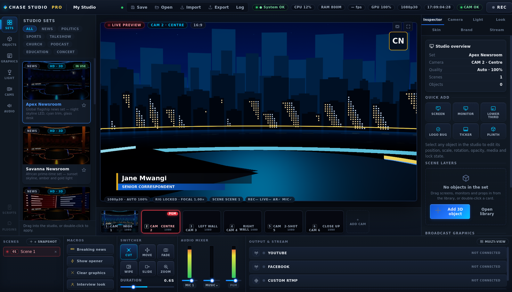
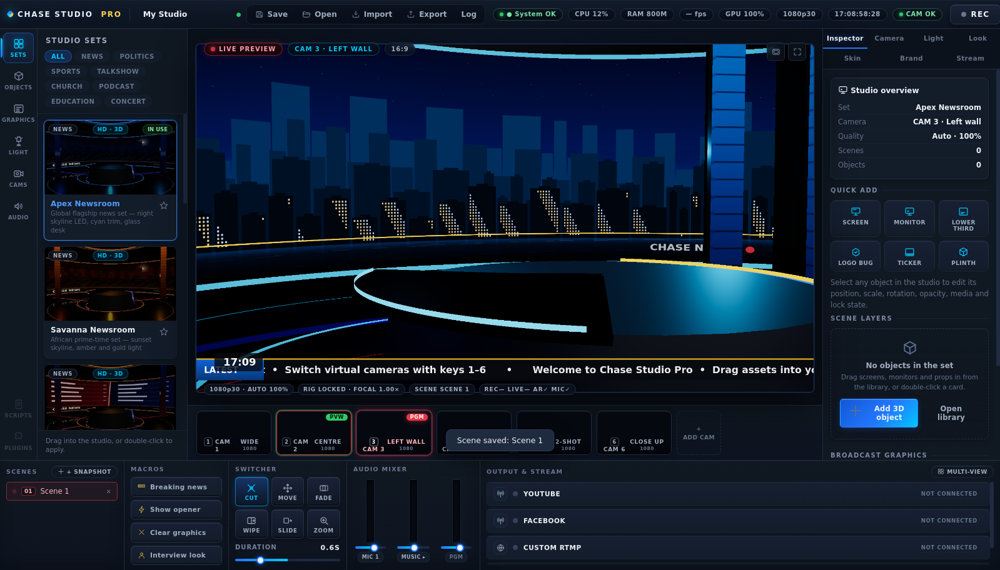

# Chase Studio Pro — Virtual Production Suite

A premium Windows virtual studio for low-budget TV stations, churches, online
broadcasters, schools, podcasters, political media teams and small production
houses. One camera in, broadcast-grade virtual studio out:
**Canva simplicity + OBS control + virtual-studio power + control-room workflow.**



## The control room



- **Top control bar** — project, save/open/import/export, autosave, System OK /
  CPU / RAM / FPS / GPU-quality / resolution / live-bitrate chips, REC, GO LIVE.
- **Icon rail + asset browser** — Sets / Objects / Graphics / Light / Cams /
  Audio, with **live-rendered 3D thumbnails** of every set (not stock images:
  each card is an actual render of that environment with your branding) and
  category filters (News, Politics, Sports, Talkshow, Church, Podcast,
  Education, Concert).
- **Cinematic viewport** — the real program output: curved LED walls with
  animated branded content, LED towers, reflective floors (true planar
  reflections), bloom, atmosphere haze, vignette, premium curved anchor desk,
  drag-and-drop with placement guides.
- **CAM 1–6 strip** — six virtual angles with **live thumbnails**, PGM tally,
  keys 1–6, CUT / MOVE / FADE / WIPE program transitions.
- **Bottom production strip** — quick **Scenes** (snapshot & recall whole
  looks), **Macros** (Breaking news, Show opener, Clear graphics, Interview),
  **Transitions** with duration, a real **audio mixer** (mic + jingle + master
  with live meters and faders), and **Output & Stream** destination rows with
  per-destination status LEDs and measured bitrate.
- **Inspector** — Inspector / Camera / Light / Look / Skin / Brand / Stream
  tabs: object transform & opacity, focal length, drift/parallax, lighting
  moods + faders + haze + desk glow, chroma key, bloom/vignette/floor
  reflection, LED-wall media, complexion presets with eye light, branding,
  destinations and output settings.

## What's real (all of it)

9 procedural 3D set packs (Apex global newsroom, Savanna African newsroom,
Mandate election desk, Grace church stage, Loft podcast room, Arena sports
desk, Pulse concert stage, Prime talkshow, Forum education studio) · GPU
chroma key + AI cutout + framed mode · 6 virtual cameras from one physical
camera · animated lower thirds, ticker, logo bug, breaking banner, title,
clock · drag-and-drop props with media-capable virtual screens · WebAudio
mixer with jingle player · local WebM recording with MP4 conversion ·
**simulcast RTMP/RTMPS** (YouTube + Facebook + custom simultaneously, one
encoder) · project save/load + shareable templates · auto quality scaling ·
live CPU/RAM/FPS/bitrate health.

Staged honestly (visible but labelled, no fake buttons): IP/NDI + second
camera, Zoom/Teams virtual camera, website embed player, scripts/rundowns,
plugins.

## Bring your own set (pre-built 3D environments)

Already have a finished studio set from Blender, Cinema 4D, Maya, Unreal or a
marketplace? Two clicks:

1. **Studio → Import environment (GLB)** — the file is validated (triangles,
   textures, memory), normalised to real-world scale and placed. Tick **"Use
   imported environment only"** in the inspector to hide the built-in set so
   only your structures show. Lights, cameras, keying and graphics keep
   working.
2. **LED / TV screens connect themselves.** Any mesh named like `Screen`,
   `TV`, `LED`, `Display`, `Monitor` or `Video` in your export is auto-detected
   as a video panel (the import report shows the count). Select the set, open
   **"LED screens · connect media"** in the inspector, click **Connect
   media…**, pick a video or image — it plays on the panel instantly and is
   saved with the project. No UV mapping, no material editing, no node graphs.

GLB is the most reliable format; FBX and OBJ also ingest.

## Quick start

```bash
npm install
npm start            # run the app
npm run check        # parse-check all sources
# headless end-to-end test (real app, fake camera, render verification):
xvfb-run -a node_modules/.bin/electron --no-sandbox --enable-unsafe-swiftshader \
  --use-fake-ui-for-media-stream --use-fake-device-for-media-stream scripts/smoke-test.js
npm run dist         # Windows NSIS installer + portable exe
```

## Honest note on virtual angles

One camera cannot produce true multi-camera footage of a person. Chase Studio
Pro layers real techniques — genuine 3D set parallax, anchor-based presenter
reframing, yaw billboarding, punch-in, operator drift — into the best
practical one-camera broadcast illusion, and says so in the product. Depth
estimation and true multi-camera input are on the roadmap.

Docs: `docs/BLUEPRINT.md` (product + roadmap + validation loops),
`docs/ARCHITECTURE.md` (stack, pipeline, state model, packaging),
`docs/UI-SCREENS.md` (screen plan vs. references),
`docs/BUILD-TASKS.md` (task list), `docs/CHECKLISTS.md` (testing + visual
acceptance vs. the reference images).
