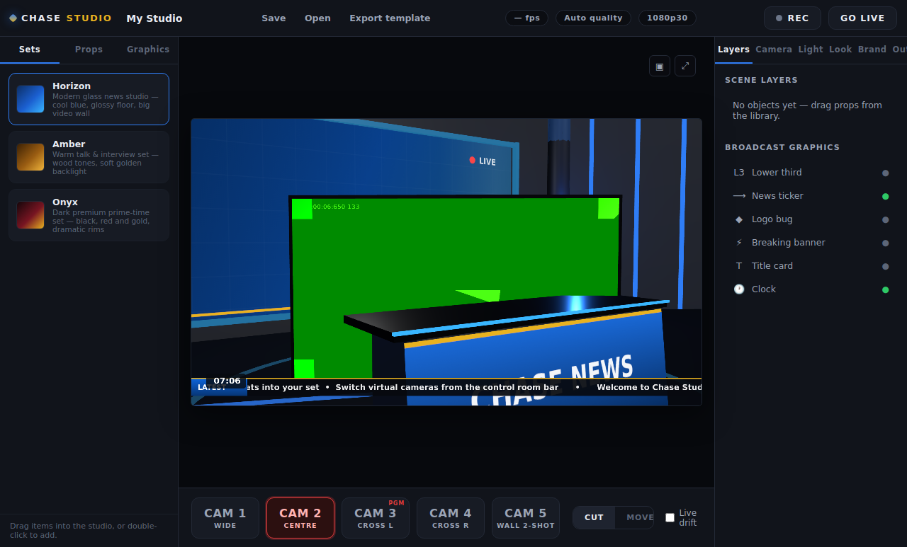
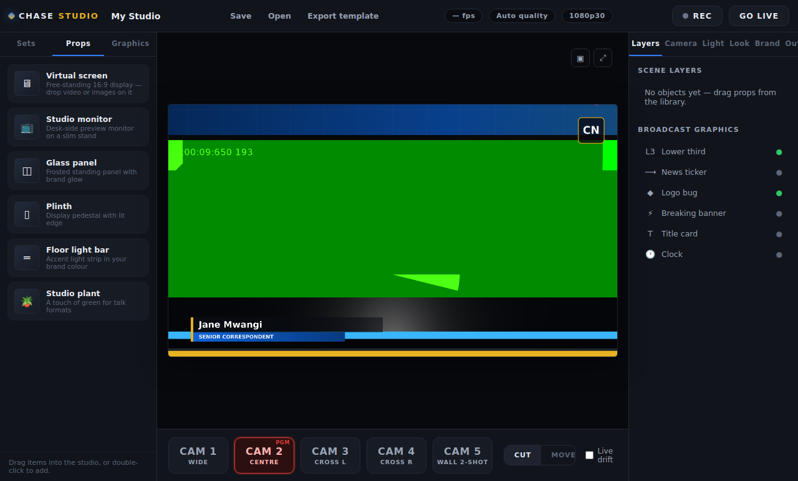

# Chase Studio — Virtual Production Suite

A Windows desktop virtual studio for small TV stations, churches, online news
channels, schools and creators. One camera in, broadcast-grade virtual set out:
**Canva + OBS + a virtual TV studio, simplified for low-budget broadcasters.**



## What it does, today

- **Real 3D newsroom sets** (3 included: Horizon, Amber, Onyx) built in WebGL —
  animated branded video wall, anchor desk, accent lighting, reflective floor.
- **One camera, five angles** — virtual cameras move through the 3D set with
  anchor-based reframing; CUT or smooth MOVE transitions, punch-in, live drift.
- **Three presenter modes** — green-screen chroma key (GPU shader with spill
  suppression), AI background cutout (MediaPipe person segmentation), or a
  "framed window" remote-studio look that needs no keying at all.
- **Broadcast graphics** — animated lower thirds, scrolling ticker, logo bug,
  breaking banner, title card and clock, all branded with your station's
  name, colours and logo.
- **Drag-and-drop scene editing** — drop props (virtual screens, monitors,
  glass panels, plinths, light bars, plants) into the set, drag them on the
  floor, scale/rotate/lift, put media on screens.
- **Lighting console** — 5 presets + key/fill/back/temperature/accent faders.
- **Image enhancement** — exposure, warmth, saturation and skin-smoothing with
  complexion presets, applied in the GPU presenter shader.
- **Record + stream** — local WebM recording (with one-click MP4 conversion)
  and RTMP/RTMPS streaming to YouTube, Facebook or any custom server via the
  bundled FFmpeg encoder.
- **Projects & templates** — save/reload `.chasestudio` projects, export
  shareable `.cstemplate` scene templates.
- **8 show presets** — news, interview, podcast, sports, weather, church,
  education and business defaults layered over any set.



## Quick start (development)

```bash
npm install
npm start          # launch the app
npm run check      # syntax-check all sources
# full headless end-to-end test (boots the real app with a fake camera):
xvfb-run -a node_modules/.bin/electron --no-sandbox --enable-unsafe-swiftshader \
  --use-fake-ui-for-media-stream --use-fake-device-for-media-stream scripts/smoke-test.js
```

## Build the Windows installer

```bash
npm run dist            # NSIS installer + portable exe in release/
```

Built on Electron + Three.js + FFmpeg. No accounts, no cloud, no subscription —
a local tool a station owns. See `docs/` for the full product blueprint,
architecture, screen plan and roadmap.

## Honest note on virtual angles

One physical camera cannot create true multi-angle parallax of a person. Chase
Studio creates the *broadcast effect* of a multi-camera studio: the virtual
cameras genuinely move through the 3D set (so the set has real parallax) while
the presenter is reframed with anchor-based composition and yaw-billboarding.
Depth estimation, head tracking and true multi-camera input are on the roadmap
(`docs/BLUEPRINT.md`).
